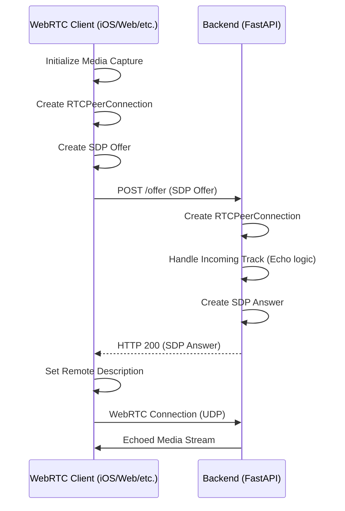

# EchoServer Implementation Documentation

This document describes the high-level architecture of the WebRTC EchoServer.

## System Architecture

The system consists of a **FastAPI** backend and a **WebRTC Frontend Client (iOS/Web/etc.)**. It facilitates real-time media streaming using the WebRTC protocol.

## Backend Implementation

### 1. Unified Peer Management
- The server maintains a collection of active peer connections.
- Graceful shutdown logic ensures all active connections are closed when the server stops.

### 2. Signaling Handling
- A dedicated endpoint receives media negotiation parameters (SDP) from clients.
- The server processes the remote description and generates a local response to establish the session.

### 3. Media Echo Logic
- The server listens for incoming media tracks from established connections.
- Received tracks are immediately looped back to the sender within the same session.

## Client Implementation Requirements

### 1. Media Capture
- The client must implement its own platform-specific media capture (e.g., `AVFoundation` for iOS, `getUserMedia` for Web).

### 2. Handshake Flow
- The client initiates the peer connection process.
- It gathers local media tracks and generates a session offer.
- The offer is exchanged with the server via the signaling endpoint.

### 3. Media Playback
- The client must handle the reception of the remote media stream and play it back using platform-specific components (e.g., Audio Players or Media Engines).

## Infrastructure & Security

- **Reverse Proxy**: Nginx handles SSL termination and proxies traffic to the FastAPI app (Uvicorn).
- **HTTPS**: Secured via Let's Encrypt on the `sslip.io` domain.
- **Firewall**: Configured for TCP (80, 443, 8000) and UDP (10000-60000).
